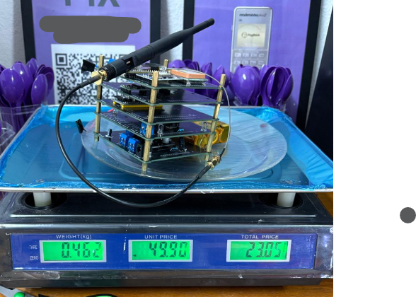

# ITA Rocket Design — Eletrônica

<p align="center">
  
</p>

Repositório com códigos, esquemáticos e materiais de referência antigos do time de Eletrônica da ITA Rocket Design.

> Participação como membro (2023) e líder de eletrônica (2024 – meados de 2025).
> Os arquivos de PCB no KiCad **não foram publicados**.

---

## Estrutura do repositório

```
.
├── ELE2025/
│   ├── Código_ESP32/       # Módulo de telemetria (GPS + LoRa)
│   ├── Código_STM32/       # Placa principal de aviónica
│   ├── Minifogutes/        # Computador de voo para minifoguetes
│   ├── Receiver/           # Receptor LoRa em terra
│   ├── drop_test/          # Código para ensaio de impacto
│   └── Balanca/            # Software para ensaio estático de empuxo
├── PCB Design/
│   ├── Minifoguetes/       # Gerbers e esquemático (KiCad)
│   └── Transdutor/         # PCB do transmissor de pressão (KiCad)
├── Schematics/             # Esquemáticos em PDF (sistema ELE IPEV)
└── Exemplos/               # Códigos de referência
```

---

## Projetos

### Minifoguetes — Computador de Voo

Firmware para Arduino embarcado nos minifoguetes da equipe. Detecta decolagem por barômetro (BMP280), registra altitude e velocidade em cartão SD e aciona a recuperação (SKIB) automaticamente no apogeu.

**Hardware:** BMP280 · Cartão SD · LED · Buzzer · SKIB
**Arquivo:** `ELE2025/Minifogutes/minifog.ino`

```
Fluxo principal
├── calib()   — média inicial de altitude e velocidade no solo
├── solo()    — aguarda decolagem (Δh ≥ Hmin e |v| ≥ 1 m/s)
└── flight()  — registra dados e aciona SKIB no apogeu
```

---

### ELE2025 — Módulo ESP32 (Telemetria)

Responsável por coletar posição GPS e transmitir via LoRa (915 MHz) para a base em tempo real.

**Hardware:** ESP32 (Heltec) · GPS UART · LoRa 915 MHz · I2C
**Arquivos:** `ELE2025/Código_ESP32/Main/`

| Arquivo       | Função                                                             |
| ------------- | -------------------------------------------------------------------- |
| `Main.ino`  | Loop principal: lê GPS, monta pacote e envia via LoRa               |
| `GPS.ino`   | Leitura e parse do módulo GPS (latitude, longitude, altitude, hora) |
| `Radio.ino` | Configuração e envio LoRa                                          |
| `I2C.ino`   | Comunicação I2C com periféricos                                   |

---

### ELE2025 — Placa Principal STM32

Placa de aviónica com múltiplos sensores, comunicação SPI com o ESP32 e protocolo de instruções para controle de periféricos.

**Hardware:** STM32 · MPU9250 (IMU ×4) · BMP280 · HX711 (célula de carga) · Bateria · LED RGB · Buzzer · 6 chaves
**Arquivos:** `ELE2025/Código_STM32/Main/`

| Arquivo         | Função                                                   |
| --------------- | ---------------------------------------------------------- |
| `Main.ino`    | Setup e loop principal                                     |
| `MPU9250.ino` | Leitura do IMU (acelerômetro, giroscópio, magnetômetro) |
| `BMP280.ino`  | Leitura de pressão e altitude                             |
| `Hx711.ino`   | Leitura de célula de carga                                |
| `SPI.ino`     | Comunicação SPI com ESP32 via enum de instruções       |
| `Bat.ino`     | Monitoramento de tensão da bateria                        |

O protocolo SPI usa um enum de instruções (`Main.h`) para controlar todos os subsistemas remotamente.

---

### Receptor LoRa

Receptor em terra baseado em Heltec ESP32. Escuta na mesma frequência/configuração do transmissor e imprime os pacotes no Serial com RSSI e SNR.

**Arquivo:** `ELE2025/Receiver/receiver.ino`
**Frequência:** 915 MHz · SF7 · BW 125 kHz

---

### Balança — Ensaio Estático de Empuxo

Software Python para aquisição de dados durante ensaios estáticos do motor. Lê força (N) e tempo (ms) via serial, plota em tempo real e salva em CSV numerado automaticamente.

**Arquivo:** `ELE2025/Balanca/BalancaV3.4.py`
**Dependências:** `pyserial`, `matplotlib`

```bash
python BalancaV3.4.py
```

Os dados são salvos em `test/t<n>.csv`.

---

### Drop Test

Código de ensaio de impacto usando BMP280 para medir altitude e velocidade durante quedas controladas.

**Arquivos:** `ELE2025/drop_test/drop_test.ino`, `MedM.ino`

---

## PCBs

Os projetos KiCad **não estão publicados**. Os arquivos Gerber para fabricação estão disponíveis:

| PCB                     | Gerbers                                                         |
| ----------------------- | --------------------------------------------------------------- |
| Minifoguetes            | `PCB Design/Minifoguetes/minifoguetes/PCB/`                   |
| Transmissor de Pressão | `PCB Design/Transdutor/transmissor/pressure_transmissor_pcb/` |

---

## Esquemáticos

`Schematics/`— Sistema modular de aviónica composto por seis placas: Base, Energia, Interface, Processamento, Sensores e Telecom. Quase um cubesat 1u.
